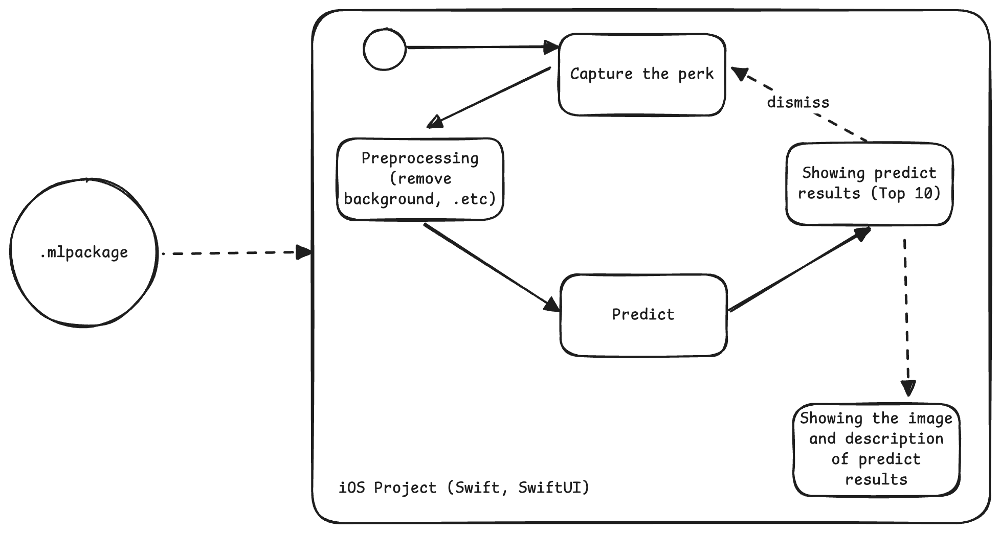
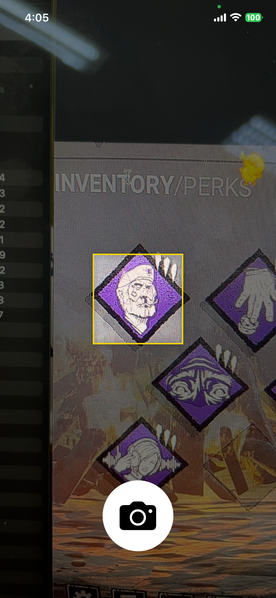
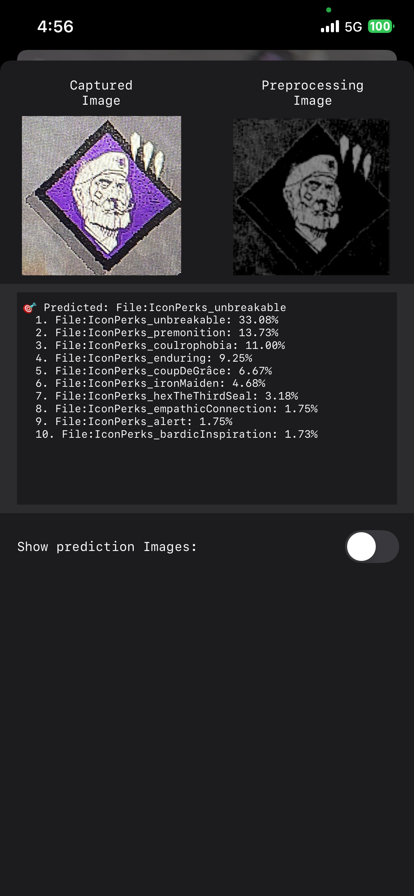
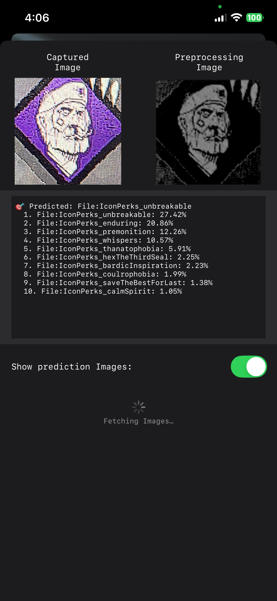
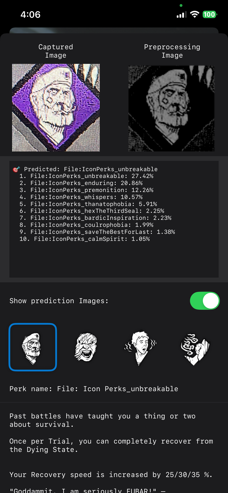

# DBD Perks Scanner (iOS)

An iOS app built with **Swift** and **SwiftUI** that identifies *Dead by Daylight* perks using on-device machine learning.  
The app captures a perk image, preprocesses it (e.g. background removal), predicts the top matching perks using a Core ML model, and displays detailed descriptions.
> **Note:** This project is for educational purposes only.

---

## 🧠 Overview

This app leverages a custom Core ML model (`.mlpackage`) trained from the dataset available in  
👉 [alifu/dbd_perks_dataset](https://github.com/alifu/dbd_perks_dataset).

The `.mlpackage` model is imported into the iOS project and used to classify perk images locally — no internet required.

---

## 🧩 System Flow

The following diagram describes the data and process flow inside the app:



---

## ⚙️ Features

- 📸 **Perk Capture** — Uses the device camera to take a photo of a perk.
- 🧽 **Preprocessing** — Cleans and normalizes the image (e.g. removes background).
- 🔮 **Prediction** — Uses Core ML to predict top 10 possible perks.
- 🖼️ **Results Display** — Shows the perk image, name, and description.
- 💾 **Offline-first** — All predictions run locally using `.mlpackage`.

---

## 🧱 Tech Stack

| Layer | Technology |
|-------|-------------|
| UI | SwiftUI |
| Camera | AVFoundation |
| ML Model | Core ML (`.mlpackage`) |
| Image Processing | Vision, Core Image |
| Language | Swift 5+ |
| Network | Moya, Alamofire |
| Cached Image | NukeUI |

---

## 📂 Repository Structure

```bash
DBD-Perks/
├── DBD_PerksApp.swift # Main SwiftUI entry point
├── Module/
│ ├── CameraView.swift # Camera View
│ ├── Capture/ # Show Camera
│ └── Prediction/ # Show prediction results
├── Extension/ # Extension some Component
├── Utils/
│ ├── CameraManager.swift # Handle the camera
│ ├── DBDPerkImageService.swift # Get the URLs image of perks
│ └── PerkImageProcessor.swift # Handles background removal, normalization, etc.
└── DBDPerkClassifier_Tuned.mlpackage # Trained Core ML model
```

---

## 🚀 Getting Started

### 1. Clone the Repository
```bash
git clone https://github.com/alifu/DBD-Perks.git
cd DBD-Perks
```

### 2. Add the ML Model

Download or generate the .mlpackage from

👉 [alifu/dbd_perks_dataset](https://github.com/alifu/dbd_perks_dataset)

and place it inside the `DBD Perks/` root directory.

### 3. Open in Xcode

Open `DBD Perks.xcodeproj` (Swift Packages will fetch library we needed).

### 4. Build & Run

Select your device/simulator and press Run ▶️.

---

## 🧪 Roadmap
| Status | Feature |
|:-------:|-----|
|✅|Capture and preprocess perk images|
|✅|Core ML prediction|
|✅|Display top 10 prediction results|
|✅|Show detailed perk info (image + description)|
|🚧|Improve preprocessing accuracy|
|🚧|Optimize ML inference performance on-device|

---

## 🖼️ Screenshot (Example)

| Capture Perk | Prediction Result | Fetch Predictions Image | Perk Description |
|:-------:|:-----:|:-----:|:-----:|
|||||

---

## 🎯 License & Attribution

The model, scripts, and dataset in this repository are provided with MIT License (see LICENSE file).

Icon images and descriptions are sourced from the [Dead by Daylight Wiki (Fandom)](https://deadbydaylight.fandom.com).
Please refer to the original wiki for usage rights and attribution.